# Example Usage

## Loading into the app:

This is what the landing page looks like when you first open the app:
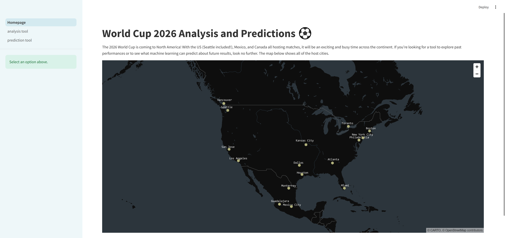

## Identifying where games will be played:

#### Imagine that you just found out that the World Cup is coming to the US and are curious where the games will be played.

Steps on app:

1. Load into app
2. Hover over city name on map
   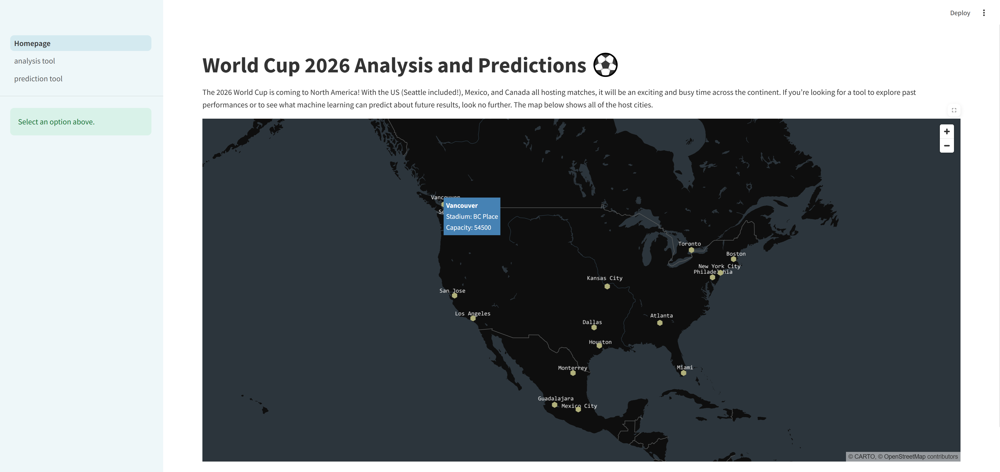

## Player Analytics:

#### As a fan you are curious how players from your region have performed in the World Cups so far.

Steps on app:

1. Load into app
2. Select the analysis tool option on the left panel
3. Load into player analytics page
   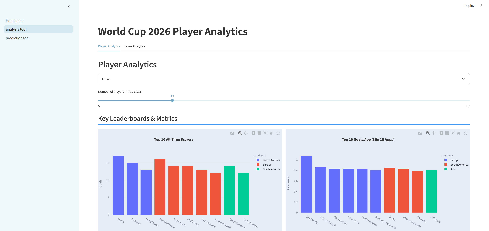
4. Use the filters to identify the subset of players you want to look at
   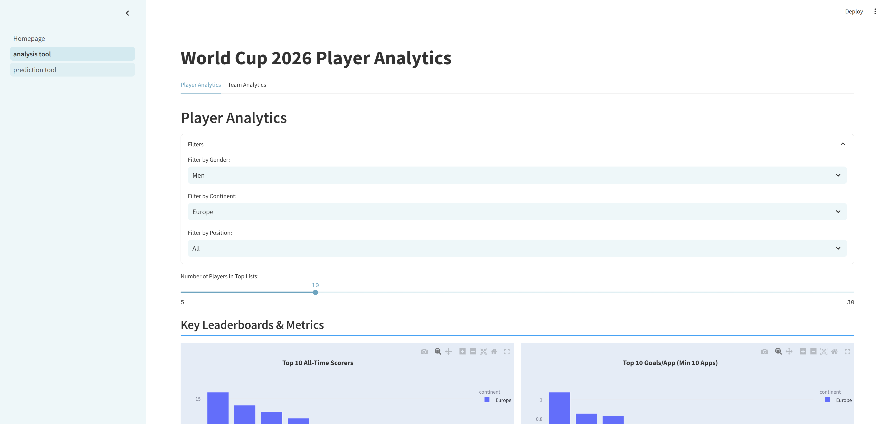
5. The page updates based on filters and presents key stats
   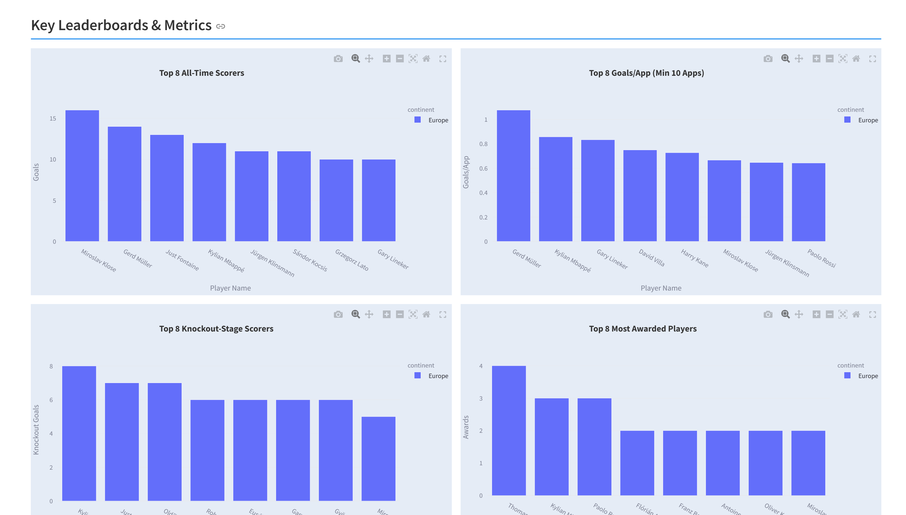

#### As someone that has been following soccer for all your life, you are curious if there are any advanced analytics that you can look at.

Steps on app:

1. Within the player analytics page, scroll down to find the more analytics dropdown
   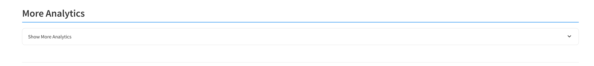
2. Click on the dropdown to get access to advanced analytics based on chosen filters
   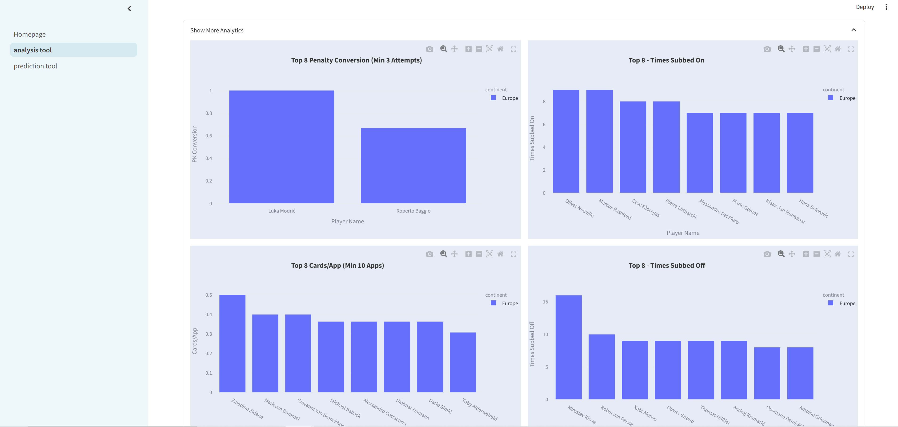

#### As someone who might be interested in utilizing advanced analytics to help place bets, you might be interested in betting on later goals which offer a higher payout so you want to have access to stats as such

Steps on app:

1. Within the player analytics page, scroll down to find impact stats
   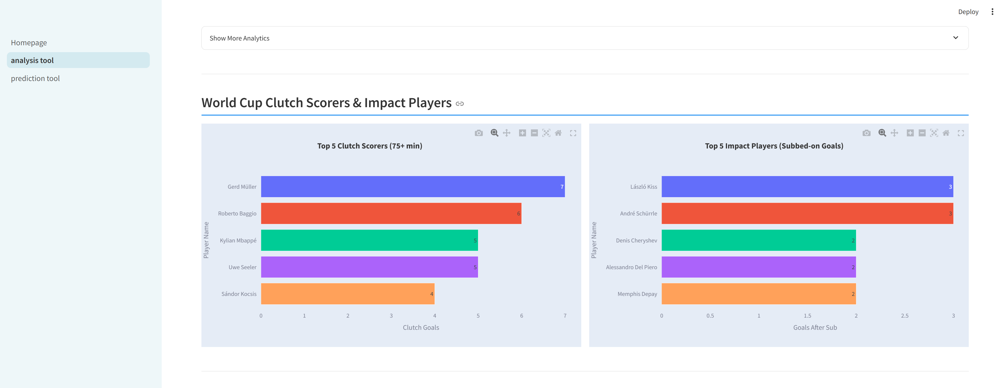

### As a huge fan of Aaron Lennon, you want to compare how his performance stands up to the current England captain Harry Kane

Steps on app:

1. Within the player analytics page, scroll down to the player comparison section
2. Select the players you want to compare
   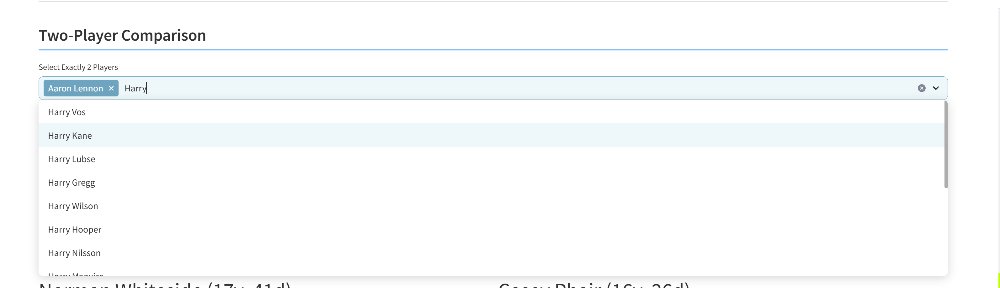
3. The page updates with player comparison
   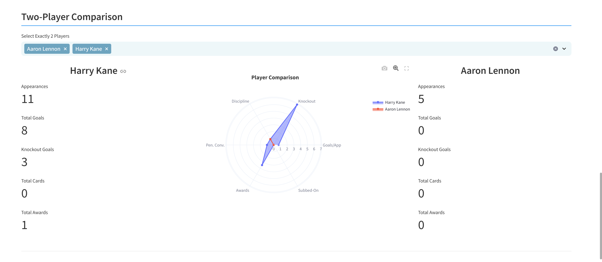

#### As someone that has been following the game for a long time, you are curious if there are any fun facts about the tournaments that you can bring up the next time you watch a game with your friends

Steps on app:

1. Within the player analytics page, scroll down to find the trivia section
   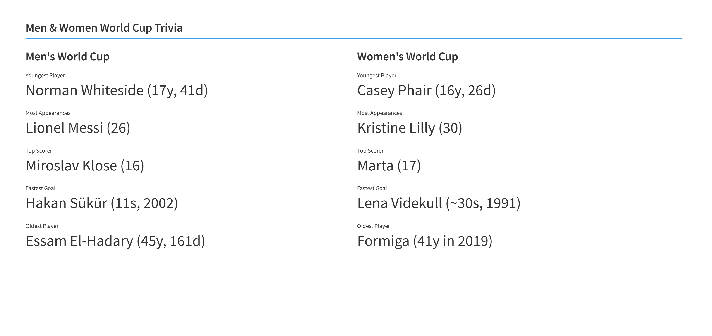

## Team Analytics:

#### With the World Cup coming up, you are curious about how different teams have performed so far

Steps on app:

1. Load into app
2. Select the analysis tool option on the left panel
3. Select the Team Analytics option on the top of the page
   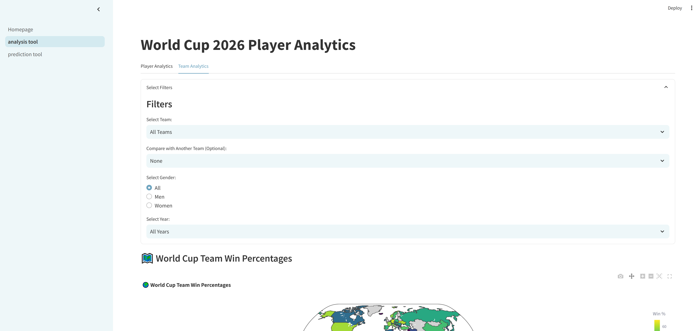
4. Scroll down to access different analytics available to you
   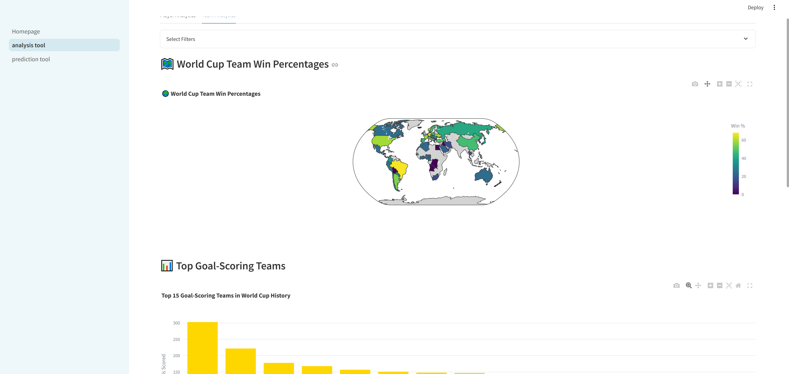
   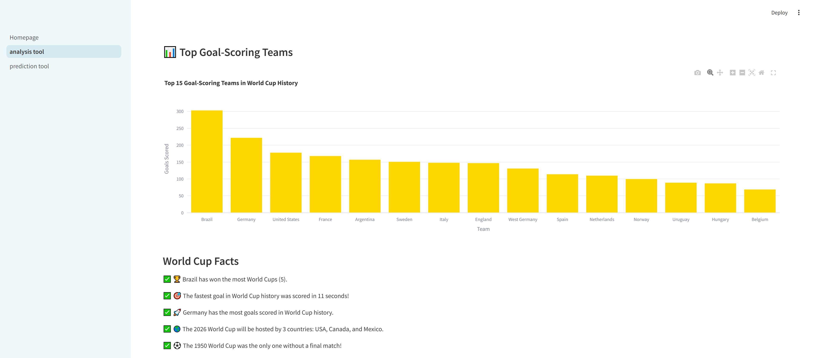

#### As a huge fan of Argentina, you want to see how they compare to the German team that has been performing well in qualifing rounds

Steps on app:

1. Within the Team Analytics page, use the filters to identify the teams you want to compare
   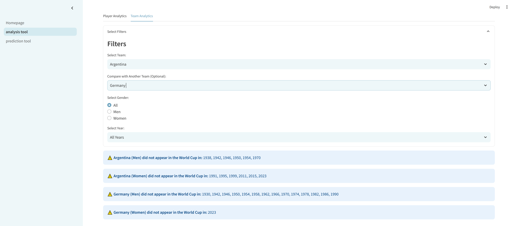
2. Scroll down to access available analytics
   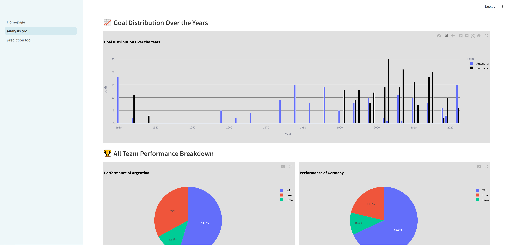
   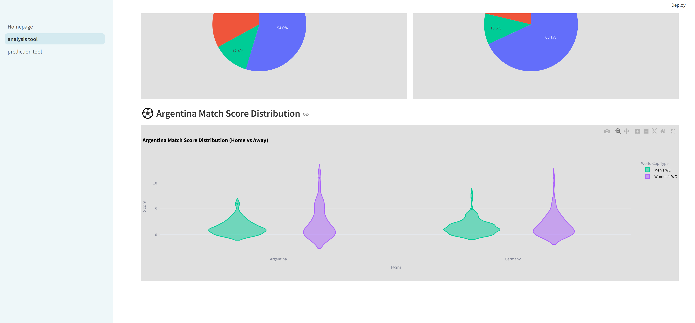

## Predictions:

#### As someone who is interested in seeing how their favorite team, Australia, will perform against a strong Brazilian team in the 2026 World Cup, you want to predict the results of the matchup in realistic setting (stadium in the US with accurate weather)

Steps on app:

1. Load into app
2. Select the prediction tool option on the left panel
3. Load into predictions page
   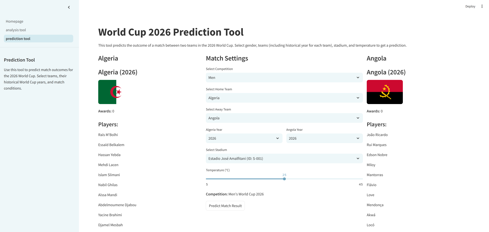
4. Select the teams, stadium, set the weather, and then click on Predict Match Result
   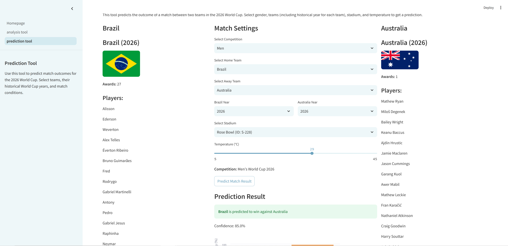

#### As someone who has watched all the World Cups from the early 2000s, you want to see how an early Argentina team performs against a stacked Belgium team from 2014

Steps on app:

1. Within the predictions page: select teams, the era for each team, optionally the weather and stadium, and then click on Predict Match Result
   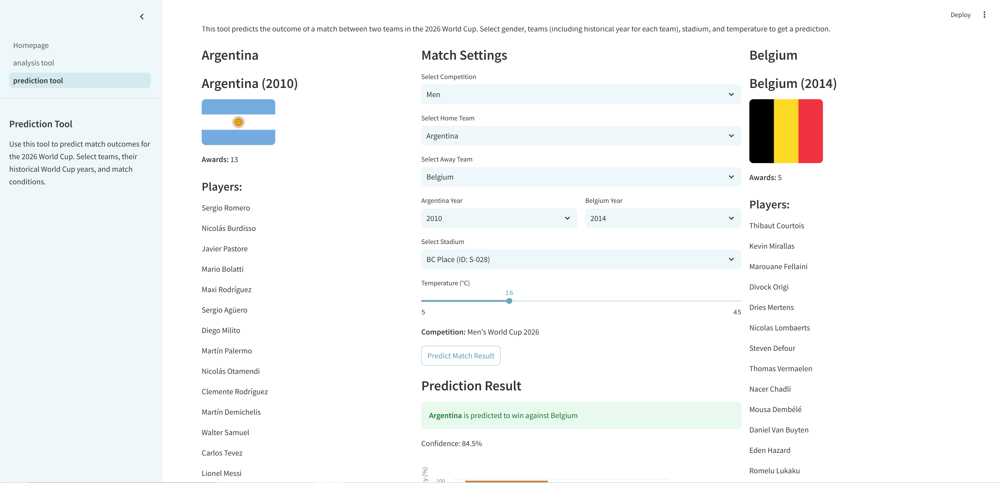

#### As someone who wants to place some bets on the upcoming matches, you want to see with how much confidence you can trust the result of the model

Steps on app:

1. Within the predictions page, setup a matchup and click on Predict Match Result
2. Scroll down to get context and confidence in results
   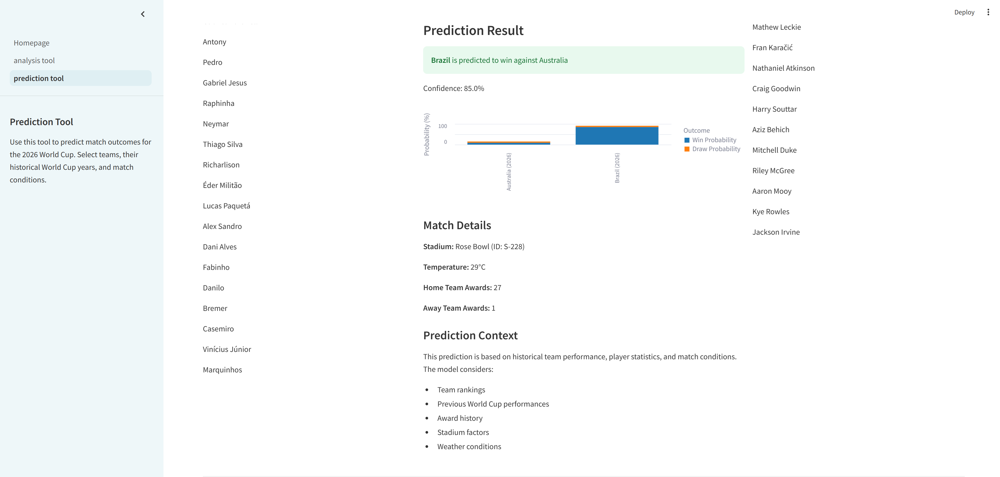

## Retraining the model:

Once the 2026 World Cup comes along and you have access to new data from the jfjelstul dataset, here are the necessary steps to re-train the model:

1. Replace the files in the `data` folder with the new files
2. Delete the `label_encoder.pkl` and `model.pkl` files from the `predictions` folder
3. Assuming you are in the root directory, change into the predictions folder using: `cd world-cup-26-predictions/world_cup_26_predictions/predictions`
4. Run the `train_model.py` script using: `python run train_model.py`

This will create a new model that the app will use to make predictions.

Additionally, if you wish to add more recent temperature values you may do so by adding the cities and their average temperatures from the noaa database to the `temperatures_partitioned` csv file in the `data` folder
